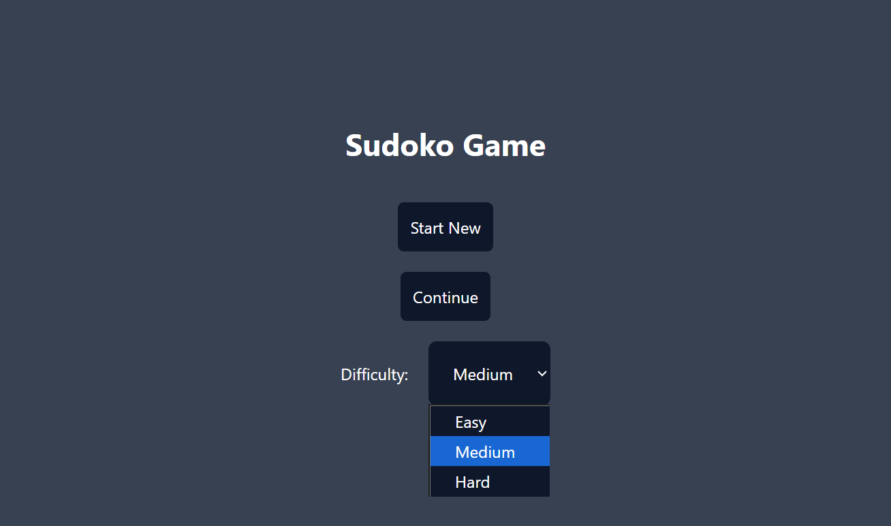
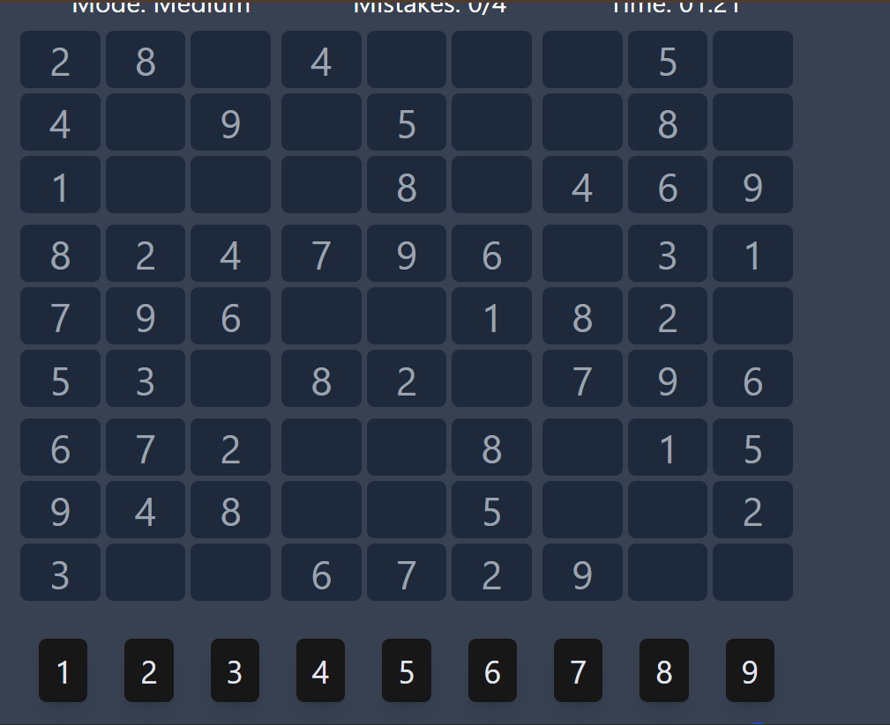
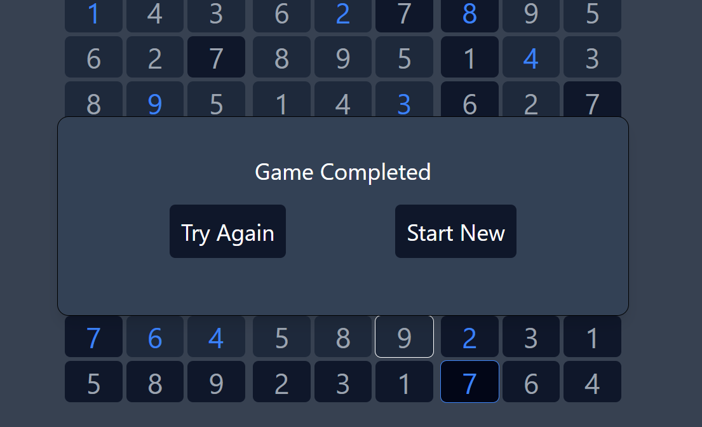

# 🧩 Sudoku Game

[](https://reactjs.org/)
[](https://tailwindcss.com/)
[](https://zustand-demo.pmnd.rs/)
[](https://vitejs.dev/)
[](LICENSE)

A modern and interactive Sudoku web application built with React, TailwindCSS, and Zustand. This project demonstrates frontend development skills, efficient state management, and responsive UI design principles.

---

## 📋 Table of Contents

- [Preview](#-preview)
- [Features](#-features)
- [Tech Stack](#-tech-stack)
- [Getting Started](#-getting-started)
- [How to Play](#-how-to-play)
- [Contributing](#-contributing)

---

## 🎬 Preview

### 🖼️ Screenshots

<div align="center">


*Homepage - Select your difficulty level*


*Active gameplay with real-time validation*


*Puzzle completion with timer*

</div>

---

## ✨ Features

- **🎲 Dynamic Puzzle Generation** – Automatically generates valid Sudoku boards with varying difficulty levels
- **📊 Multiple Difficulty Levels** – Choose between Easy, Medium, and Hard modes
- **✅ Real-Time Validation** – Instantly checks if your moves are valid
- **📱 Fully Responsive** – Built with TailwindCSS for seamless experience across all devices
- **⚡ Fast State Management** – Powered by Zustand for efficient global state handling
- **⏱️ Game Timer** – Track your solving time
- **🔄 Reset Functionality** – Restart puzzles anytime
- **💡 Hints System** – Get help when you're stuck (optional)
- **🎨 Clean Modern UI** – Intuitive and visually appealing interface

---

---

## 🛠 Tech Stack

| Technology | Purpose |
|-----------|---------|
|  | Frontend library for building UI components |
|  | Utility-first CSS framework for styling |
|  | Lightweight state management library |
|  | Fast development build tool |
|  | Programming language |

---

## 🚀 Getting Started

### Prerequisites

Ensure you have the following installed on your system:

- **Node.js** (v16 or higher)
- **npm** or **yarn** package manager

### Installation

1. **Clone the repository**

```bash
git clone https://github.com/huzaifa-cell/sudoku-game.git
```

2. **Navigate to the project directory**

```bash
cd sudoku-game
```

3. **Install dependencies**

```bash
npm install
# or
yarn install
```

4. **Start the development server**

```bash
npm run dev
# or
yarn dev
```

5. **Open your browser**

Navigate to `http://localhost:5173` (or the port shown in your terminal)

### Build for Production

```bash
npm run build
# or
yarn build
```

The optimized production build will be available in the `dist/` folder.

---

## 🎮 How to Play

1. **Select Difficulty** – Choose from Easy, Medium, or Hard
2. **Fill the Grid** – Enter numbers 1-9 in each cell
3. **Follow the Rules** – No duplicates in any row, column, or 3×3 box
4. **Use Hints** – Get assistance if you're stuck (if available)
5. **Complete the Puzzle** – Solve it as fast as you can and beat your time!

### Game Rules

- Each row must contain digits 1-9 without repetition
- Each column must contain digits 1-9 without repetition
- Each 3×3 sub-grid must contain digits 1-9 without repetition

---


---

## 🧠 Project Highlights

This Sudoku Game was developed as a **semester project** to showcase:

- **Component-Based Architecture** – Modular and reusable React components
- **State Management** – Efficient global state handling with Zustand
- **Algorithm Implementation** – Puzzle generation and validation logic
- **Responsive Design** – Mobile-first approach using TailwindCSS
- **User Experience** – Intuitive interface with real-time feedback

---

## 🤝 Contributing

Contributions are welcome! If you'd like to improve this project:

1. Fork the repository
2. Create a new branch (`git checkout -b feature/AmazingFeature`)
3. Commit your changes (`git commit -m 'Add some AmazingFeature'`)
4. Push to the branch (`git push origin feature/AmazingFeature`)
5. Open a Pull Request

---


---

## 👨‍💻 Author

**Huzaifa Kashif**

- GitHub: https://github.com/huzaifa-cell
- LinkedIn: https://www.linkedin.com/in/mohammad-huzaifa-kashif-218121272/
---

## 🙏 Acknowledgments

- Inspiration from classic Sudoku puzzle games
- React community for excellent documentation
- TailwindCSS for making styling effortless
- Zustand for lightweight state management

---

## ⭐ Show Your Support

If you found this project helpful or interesting, please consider giving it a ⭐ on GitHub!

---
